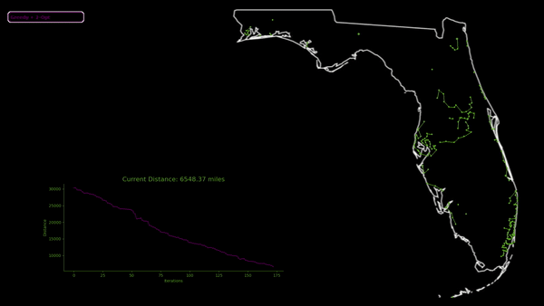

# Traveling Salesman Problem Approximation Visualization
This project explores various algorithims which can be used to approximate a solution to a traveling salesman problem.

## Approximation Algorithms
1.  [Nearest Neighbor](#nearest_neighbor)
2.  [Greedy Heuristic](#greedy)
3.  [Greedy + 2-Opt](#2opt)
4.  [Greedy + 3-Opt](#3opt)
5.  [Divide and Conquer](#divide)
6.  [Nearest Insertion](#nearest_insert)
7.  [Furthest Insertion](#furthest_insert)
8.  [Christofides](#christofides)
9.  [Tabu Search](#tabu)
10. [Genetic](#genetic)
11. [Simulated Annealing](#anneal)
12. [Ant Colony Optimization](#ant)
13. [Bee Colony Optimization](#bee)
14. [Black Hole Optimization](#black_hole)
15. [Brute Force](#brute)

## Nearest Neighbor Approximation <a name="nearest_neighbor">
The nearest neighbor algorithm starts with a random city in the tour. Then with each iteration the city which is closest to the last added city is added to the tour until all cities have been added. This version of the nearest neighbor algorithm works in parallel, using different random starting points to build different routes in parallel.

## Greedy Heuristic <a name="greedy">

This algorithm is similar in principle to Kruskal's MST algorithm. It begins by creating a sorted list of edges, then evaluates each edge to determine whether it should be added to the tour. What differentiates this algorithm from Kruskal's is that only endpoints of constructed segments are considered when adding new edges.
As an example, if we have two segments A-B-C and D-E, if edge B-D was the next lowest weight edge that we are to consider, it would be rejected, as B is not an endpoint. Edge C-E, should it be the next lowest weight edge, would be accepted, and this would result in combining the two endpoints into a single segment A-B-C-D-E.

## Greedy + 2-Opt <a name="2opt">

The 2-Opt algorithm is a subset of the k-Opt class of algorithms. The 2-Opt variant takes in an initial tour (generated by the greedy heurisitc in this instance) and swaps items in the tour. If the tour resulting from the swap is an improvement, the new tour is retained. The algorithm terminates once there are no remaining swaps which will produce an improvement.

## Greedy + 3-Opt <a name="3opt">
The 3-Opt version is an extension of the 2-Opt. However, instead of checking if a swap of two cities produces an improvement, it checks if a swap of three cities is. There are 23 possible variations of swapping three items. Once again this algorithm terminates when there are no remaining swaps which would produce an improvement.

## Divide and Conquer <a name="divide">

This algorithm works by breaking down the list of cities into small chunks that can be ordered effectively via brute force. Then the closest chunks are combined by finding the connections between the two smaller tours which minimizes the total distance when they are connected. This process continues until all divided tours have been recombined.

## Nearest Insertion <a name="nearest_insert">

This algorithm starts by randomly selecting a city, then adding that city's nearest neighbor to the route. From there, the remaining city that is closest to any city in currently in the route is identified. This city is then inserted into the position in the tour which minimizes the total distance of the tour.

## Furthest Insertion <a name="furthest_insert">

This algorithm is similar to the nearest insertion algorithm, however, instead of selecting the city that is closest to any of the already included cities, it identifies the city that is furthest from any of the cities in the current tour. This city is then inserted into the tour in the position which minimizes the total distance of the tour.

## Christofides <a name="christofides">

This algorithm follows a multi-step process. First, it builds a MST. Then, it identifies which cities have an odd number of connections. These odd vertex cities are then connected to the closest city which also has an odd number of connections. After this, a valid tour is constructed via an euler tour, while ignoring duplicate cities.

## Tabu Search <a name="tabu">
Tabu search is similar to the 2-opt algorithm in that in attempts to improve an existing solution via swapping elements. This version begins by generating an initial solution via the furthest insertion algorithm. Then, for every iteration of tabu search, it identifies the swap that results in the lowest distance. If this solution is better than the existing solution, it is kept and becomes the new current solution. Otherwise, this solution is added to a tabu list, and further swaps are made on it. The tabu list ensures that we do not repeatedly return to local minima. If a potential solution candidate is on the tabu list, it is rejected, and another candidate is explored.

## Genetic <a name="genetic">
A genetic algorithm is one which attempts to mimic evolutionary processes. It works by intializing a population of random routes and determining their fitness. This fitness is then used to select which individuals from the population will be allowed to mate and have their information carry on into the next generation. Once the mating pool has been created, individuals are randomly paired, and offspring are produced using crossover. These new individuals then undergo random mutation before this process repeats.

## Simulated Annealing <a name="anneal">
Simulated annealing works by mimicing metallurgical processes. It begins with an initial solution, then every iteration a new tour is created by performing a random perturbation on the current solution. If this solution is better than the current one, it is accepted. If it is worse, it is accepted with a percentage of e-(C/temp). This temperature value is gradually reduced as the algorithm iterates, resulting in the probability of accepting a worse solution decreasing as the algorithm iterates.

## Ant Colony Optimization <a name="ant">
Ant colony optimization utilizes worker ants to stochastically explore the solution space via pheromones. Every iteration, each ant will start at a random point and examine all possible neighbors. These neighbors are evaluated on the strength of the pheromones connecting the two cities (ants prefer to follow stronger pheromones) and the distance to the city. Once each ant has selected a route, they each increase the strength of the pheromones on the tour that they selected. Finally, a certain percentage of pheromones evaporate, gradually reducing the strength of the pheromone trails on unused connections.

## Bee Colony Optimization <a name="bee">
A bee colony optimization utilizes two different types of bees, a worker bee, and an onlooker bee. The worker bees are initially sent from the hive to random locations in the solution space. Every iteration, they proceed to explore the space in the vicinity of their location, and if now improvements have been made for a number of iterations, it is redeployed to a new random location. Every iteration, the onlooker bees are deployed to the location of the best worker bee, and are used to reenforce exploration around this point.

## Black Hole Optimization <a name="black_hole">
Black hole optimization begins by initialing a number of stars in random location in the solution space. The star with the best tour is designated as the black hole, and all other stars are drawn towards the black hole by randomly making it more similar. Should a star get to close to the black hole, it will cross the event horizon and be absorbed by the black hole. When this happens, the unlucky star is reinitialized to a random location.

## Brute <a name="brute">
This is the classic brute force method. It iterates through every possible ordering of the cities and returns the best one. This algorithm will not complete before the heat death of the universe.
